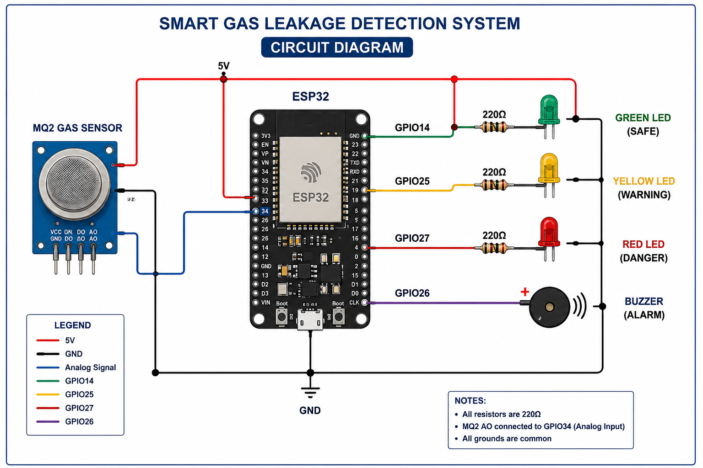

# Smart Gas Leakage Detection and Alert System using ESP32

<div align="center">


<p>


</p>

</div>

---

# 📖 Project Overview

The **Smart Gas Leakage Detection and Alert System** is an IoT-based safety solution that continuously monitors combustible gases using an **MQ2 Gas Sensor** connected to an **ESP32**.

Whenever gas concentration exceeds safe limits, the system instantly:

* 🟢 Shows Safe Status
* 🟡 Displays Warning Level
* 🔴 Activates Danger Alarm
* 🔔 Turns ON Buzzer
* 📱 Sends data to Blynk IoT Dashboard
* 🌐 Provides Remote Monitoring

---

# ✨ Features

✅ Real-Time Gas Detection

✅ WiFi Connectivity

✅ ESP32 Controller

✅ Blynk IoT Dashboard

✅ Three-Level Safety Indication

✅ Live Sensor Monitoring

✅ Audible Alarm

✅ Low Cost

✅ Easy Installation

---

## 📄 Project Report

- [HTML Report](Smart_Gas_Leakage_Detection_Report.html)

---

## 🔌 Circuit Diagram

<p align="center">
  
</p>


---

# 🛠 Hardware Used

| Component       | Quantity    |
| --------------- | ----------- |
| ESP32 Dev Board | 1           |
| MQ2 Gas Sensor  | 1           |
| Green LED       | 1           |
| Yellow LED      | 1           |
| Red LED         | 1           |
| Active Buzzer   | 1           |
| Breadboard      | 1           |
| 220Ω Resistors  | 3           |
| Jumper Wires    | As Required |

---

# 🔌 Circuit Connection

| Device            | ESP32 Pin |
| ----------------- | --------- |
| MQ2 Analog Output | GPIO34    |
| Green LED         | GPIO14    |
| Yellow LED        | GPIO25    |
| Red LED           | GPIO27    |
| Buzzer            | GPIO26    |

---

# ⚙️ Working Flow

```text
Gas Leakage
      │
      ▼
 MQ2 Gas Sensor
      │
      ▼
    ESP32
      │
      ├──────────────► Blynk IoT Dashboard
      │
      ├──────────────► Green LED (Safe)
      │
      ├──────────────► Yellow LED (Warning)
      │
      ├──────────────► Red LED (Danger)
      │
      └──────────────► Buzzer Alarm
```

---

# 📱 Blynk Dashboard

* Live Gas Reading
* Status LED
* Manual Buzzer Control
* Instant Notifications

---


# 🚀 Future Enhancements

* 📲 WhatsApp Notification
* ☁️ Firebase Integration
* 📈 Cloud Analytics
* 🔥 Automatic Gas Valve Shutoff
* 🔋 Battery Backup
* 📺 OLED Display
* 🤖 AI-Based Gas Prediction

---

# 📊 Project Highlights

| Feature              | Status |
| -------------------- | ------ |
| ESP32                | ✅      |
| MQ2 Sensor           | ✅      |
| WiFi                 | ✅      |
| Blynk IoT            | ✅      |
| LEDs                 | ✅      |
| Buzzer               | ✅      |
| Real-Time Monitoring | ✅      |

---

# 🏆 Applications

🏠 Smart Homes

🏭 Industries

🧪 Laboratories

🍳 Restaurants

🏨 Hotels

🔥 Fire Safety Systems

---


# 💻 Installation

```bash
git clone https://github.com/abhay288/Smart-Gas-Leakage-Detection-System.git

Open Arduino IDE

Install ESP32 Board

Install Blynk Library

Upload Code

Connect to WiFi

Monitor using Blynk
```


⭐ If you like this project, don't forget to **Star** this repository.
